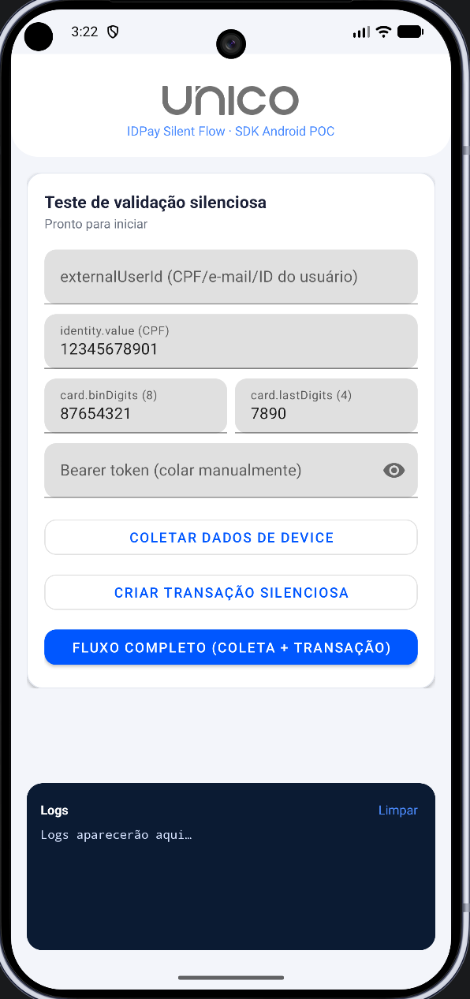

<p align="center">
  <a href="https://unico.io">
    
  </a>
</p>

<h1 align="center">IDPay Silent Flow — SDK Android POC</h1>

<div align="center">

### POC de teste ponta a ponta da validação silenciosa de transações via SDK Android + IDPay


</div>

---

## 🎯 O que esta POC faz

Este projeto testa o fluxo de **validação silenciosa de transações** em um app nativo:

1. O app chama `prepareCamera` da SDK Android passando um `PrepareInfo(externalUserId)`. Isso inicia uma coleta de dados de device **em background** — sem abrir a câmera nem exigir nenhuma captura do usuário.
2. O app cria uma transação no IDPay (`POST /api/public/v1/credit/transaction`) enviando o **mesmo `externalUserId`** em `additionalInfo.externalUserID`. Em uma integração real essa chamada é feita pelo **backend do cliente** (server-to-server) — a POC encurta esse caminho chamando a API diretamente.
3. O backend localiza a coleta do passo 1 pelo identificador e valida o device contra o histórico do usuário:
   - `status: approved` → **aprovação silenciosa**, sem nenhuma fricção (tela verde);
   - senão → o app abre o `link` de challenge automaticamente (Custom Tabs) e recebe o retorno via deep link.

O botão **Fluxo completo** roda os dois passos em sequência. A linha de status do card mostra o ciclo da coleta (`⏳ enviando… → ✓ dados prontos`) e o painel de logs registra cada etapa com tempos medidos.

<p align="center">
  
</p>

> ⚠️ O envio da coleta é assíncrono (*fire-and-forget*). A POC conta uma **janela de segurança de 5s** em background a partir do fim do prepare; se a transação for pedida antes da janela fechar, o tempo restante é absorvido na tela de loading — se depois, a transação sai na hora. Em produção, recomenda-se disparar o `prepare` na **entrada** da tela de pagamento, para que a navegação natural do usuário absorva esse tempo.
>
> ⚠️ O `externalUserId` da coleta e o `additionalInfo.externalUserID` da transação precisam ser **idênticos, char a char**. Qualquer diferença faz a busca falhar silenciosamente (transação cai no fluxo com challenge, sem erro).
>
> ⚠️ A coleta tem **validade máxima de 5 minutos**: a transação precisa ser criada dentro dessa janela para a coleta ser aceita. Passado esse tempo, dispare uma nova coleta antes de transacionar.
>
> ⚠️ As primeiras transações de um `externalUserId` retornam challenge — a aprovação silenciosa depende de histórico prévio (coleta + transação-base validada) no **mesmo device**.

---

## 💻 Compatibilidade

- **Android:** 7.0 (API nível 24) ou superior
- **Kotlin:** 2.2
- **Dispositivo físico** recomendado para resultados realistas de device intelligence.

---

## ⚙️ Configuração antes de rodar

Este repositório **não contém nenhuma credencial real**. Antes de compilar, substitua os placeholders abaixo pelos valores do seu ambiente:

| Onde | O que trocar | Valor |
| --- | --- | --- |
| `app/build.gradle` | `applicationId` e `namespace` | Seu bundle identifier registrado na Unico |
| `UnicoConfig.kt` | `getBundleIdentifier()` | O mesmo bundle identifier acima |
| `UnicoConfig.kt` | `getHostKey()` | Sua **SDK Key** (Client API Key), com o envio de `PrepareInfo` habilitado |
| `PocConfig.kt` | `COMPANY_ID` | O UUID da sua company no IDPay |

O **access token (Bearer)** **não é hardcoded** — cole-o diretamente no campo "Bearer token" da tela antes de rodar o teste, já que costuma ter validade curta.

Para gerar as credenciais Unico, consulte a [documentação oficial](https://developer.unico.io/).

---

## 📦 Instalação

### 🔒 Permissões

Já configuradas no `AndroidManifest.xml`:

```xml
<uses-permission android:name="android.permission.CAMERA" />
<uses-permission android:name="android.permission.INTERNET" />
```

### 📥 Dependência da SDK

Configurada em `app/build.gradle`:

```gradle
implementation "io.unico:capture:<version>"
```

---

## ▶️ Rodando o teste

1. Abra o projeto no Android Studio e aguarde o sync do Gradle.
2. Preencha o `externalUserId` (vazio, usa o CPF), CPF e cartão (bin/últimos 4) — ou mantenha os valores de exemplo — e cole o Bearer token.
3. **Cenário rápido:** toque em **Fluxo completo** — a coleta roda em background e a transação sai assim que a janela de envio fecha (o loading absorve só o tempo restante).
4. **Cenário recomendado:** toque em **Coletar dados de device**, aguarde o status virar `✓ Dados de device prontos` e então toque em **Criar transação silenciosa** — a transação sai instantaneamente, sem loading extra.
5. Acompanhe o resultado: tela verde **Aprovado!** (validação silenciosa) ou abertura automática do challenge no navegador.
